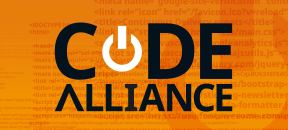
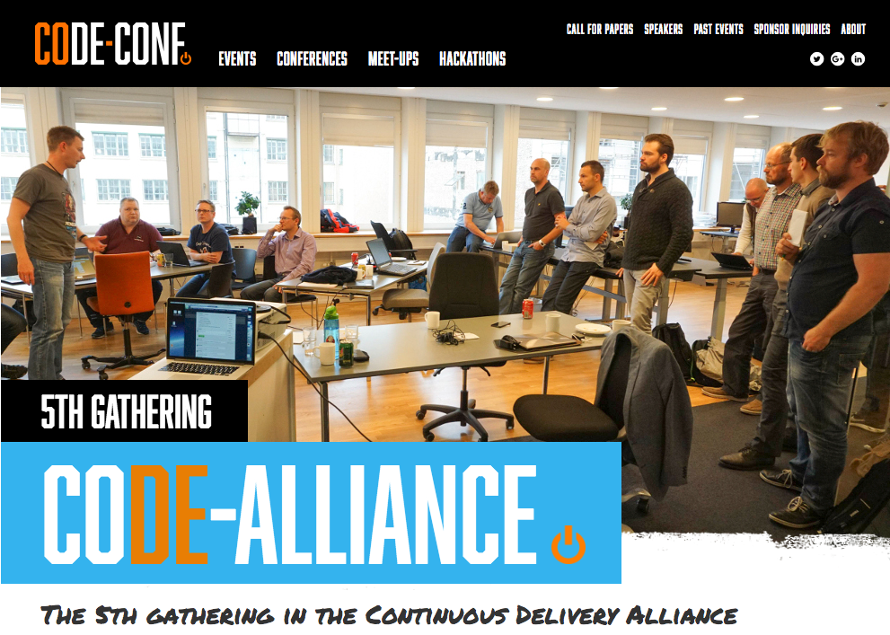

<!--

 To include this markdown in your reveal add the following section:

  <section data-markdown="name-of-your-markdown.md"
    data-separator="^>>>>NEWSECTION$"
    data-separator-vertical="^>>>>NEWSLIDE$"
    data-separator-notes="^Note:$">
  </section>

-->

## The Continuous Delivery Alliance

<!-- .element: class="plain  medium" -->

The alliance formerly known as JOSRA, discards the membership fee and opens up for new members - Welcome to our

### 5th gathering

>>>>NEWSLIDE

### The Continuous Delivery pipeline

<!-- .element: class="plain max" -->

The factory floor in a software development factory

>>>>NEWSLIDE

## Program

[<!-- .element class="plain max"-->](http://www.code-conf.com/code-alliance-5th/)<!-- .element target="_blank" -->

>>>>NEWSLIDE

### Praqma
Andrey 
Bosse 
Bue 
Hans 
Johan 
Lars 
Mads B. 
Mads N. 
Martin 
Sofus 
Thierry

<!-- .element: class="names"  -->

  

  ### Grundfos
  Flemming 
  Gert 
  Rasmus 
  Ole
  
<!-- .element: class="fragment names" -->

  

  ### Danfoss
  Jan 
  Knud 
  Lecitia 
  Marcus
  
<!-- .element: class="fragment names" -->

  

  ### MAN D & T
  Carsten 
  Niels Christian 
  Janne 
  &nbsp;
  
<!-- .element: class="fragment names"-->

  

  ### Kamstrup
  Dan 
  Michael 
  ??? 
  &nbsp;
  
<!-- .element: class="fragment names" -->

  

  

  ### Siemens WP
  Bert 
  Søren 
  &nbsp; 
  &nbsp;
  
<!-- .element: class="fragment names" -->

  

  ### BK Ultrasound
  Niklas 
  Tommy 
  &nbsp;
  
<!-- .element: class="fragment names" -->

  

  ### Napatech
  Dennis 
  Rasmus 
  &nbsp;
  
<!-- .element: class="fragment names" -->

  

  ### Volvo
  Anders 
  &nbsp; 
  &nbsp;
  
<!-- .element: class="fragment names" -->

<!-- .element: style="width:100%" -->

Note:

In Praqma we strive to practice the _buy a man - get a team_ approach with every customer. Consequently, every customer should ideally know more Praqma employees than just the usual suspects that helps them on a daily basis.

The Code Alliance is a means for that - that's why we prioritize to send so many of our own people

>>>>NEWSECTION

## State of the Alliance

<!-- .element: class="plain  medium" -->

What’s new, what has changed. Status on backlog, pipeline and roadmaps.

>>>>NEWSLIDE

## 2Git
### Git migration ...as code

2git is a Groovy DSL, a small language that is designed to migrate your code [2git](http://www.2git.io).

<!-- .element class="fragment" -->

You write your migration recipe and feed it into the 2git engine, which will then execute your migration, resulting in your git repository.

<!-- .element class="fragment" -->

If you don’t like what you see, you can easily tweak your recipe and run it again, until you get the perfect migration.

<!-- .element class="fragment" -->

**Contributors** 
Grundfos (ClearCase UCM) 
Volvo (Base ClearCase) 
&nbsp; 
**Expected** 
Danfoss (ClearCase UCM) 
MAN Diesel & Turbo (Synergy) 
GitHub, Chubb, HSBC (RTC) 

<!-- .element: class="fragment names" -->

Note:

2Git is founded on experiences gained at Atmel, made generically available by Grundfos, Evolved by Volvo and expected to be evolved even further...

>>>>NEWSLIDE

## Tracey
### Listens to _anything_ and captures _everything_

From idea to live in production at:

<!-- .element class="fragment" -->

**Contributors** 
Grundfos 
Volvo 
&nbsp; 

<!-- .element: class="fragment names" -->

>>>>NEWSECTION

## Brainstorm Ideas

>>>>NEWSECTION

## Grundfos

>>>>NEWSECTION

## World Cafés

>>>>NEWSECTION

## Wrap up
