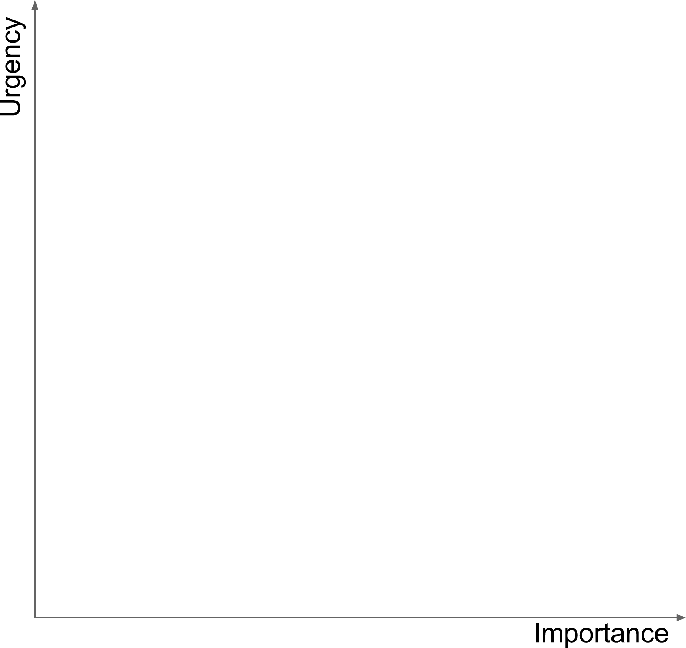
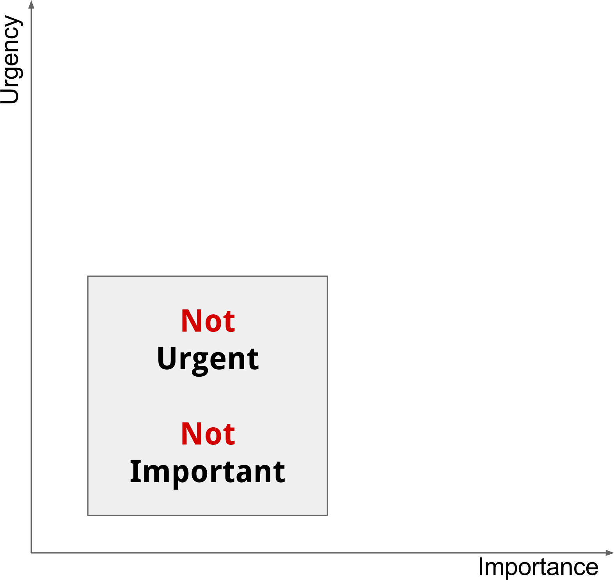
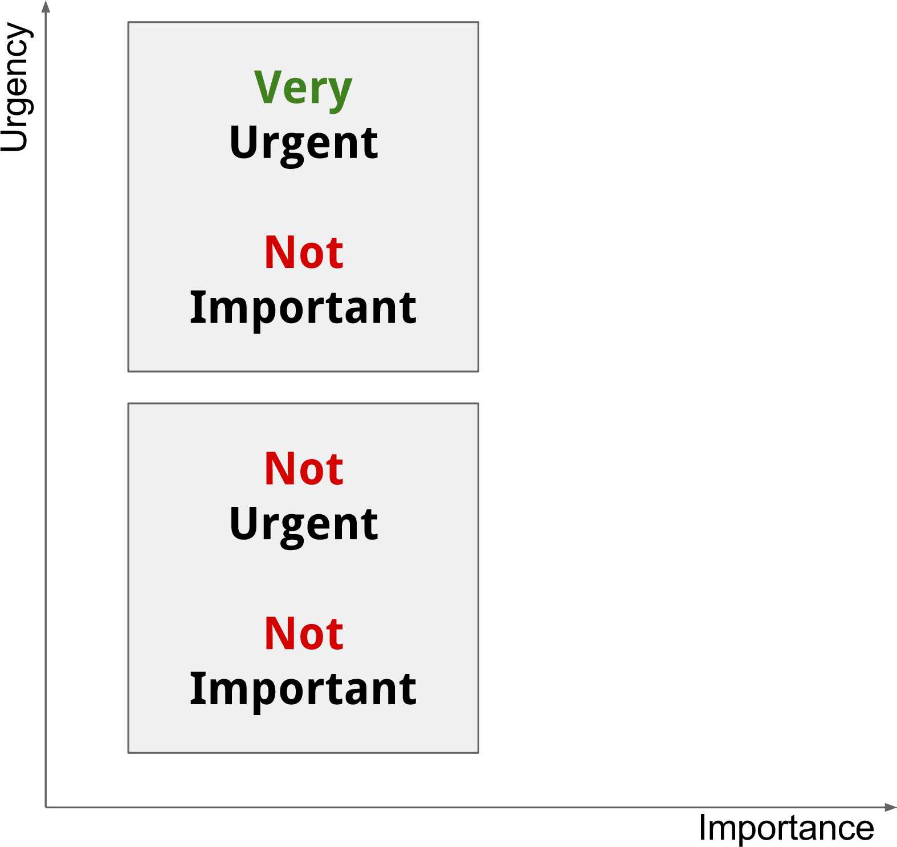
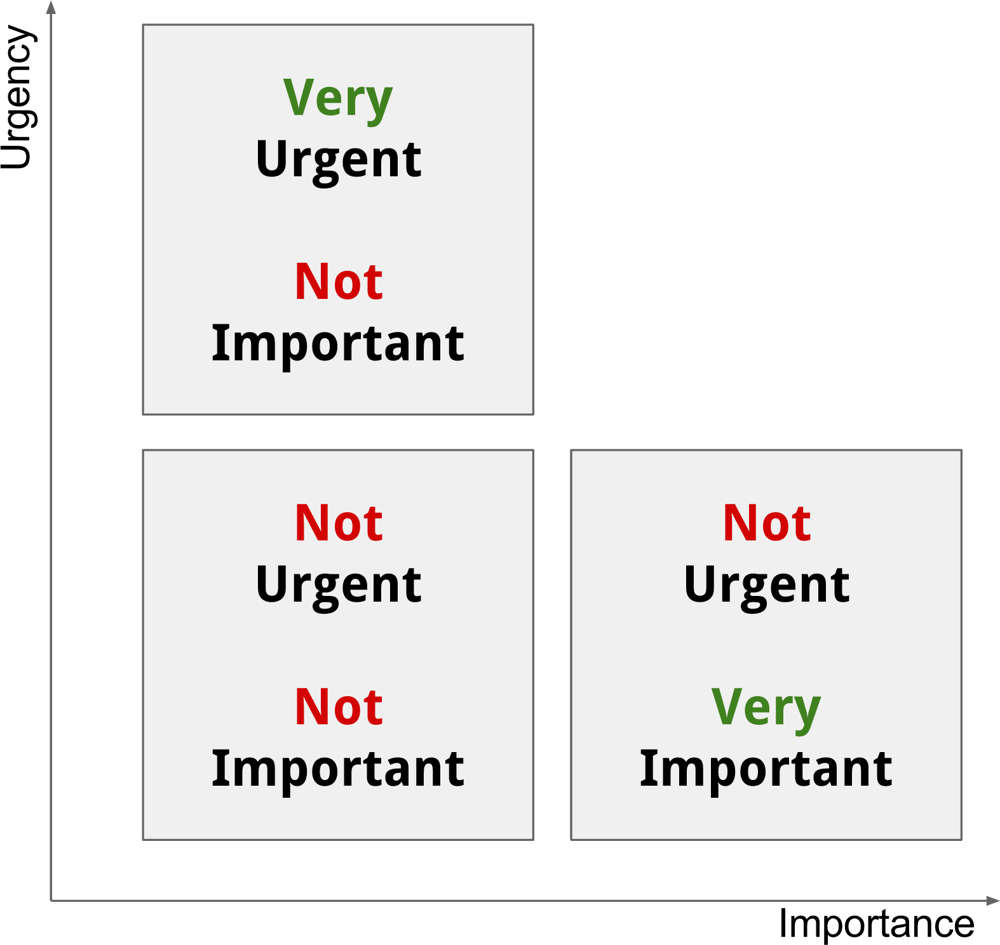
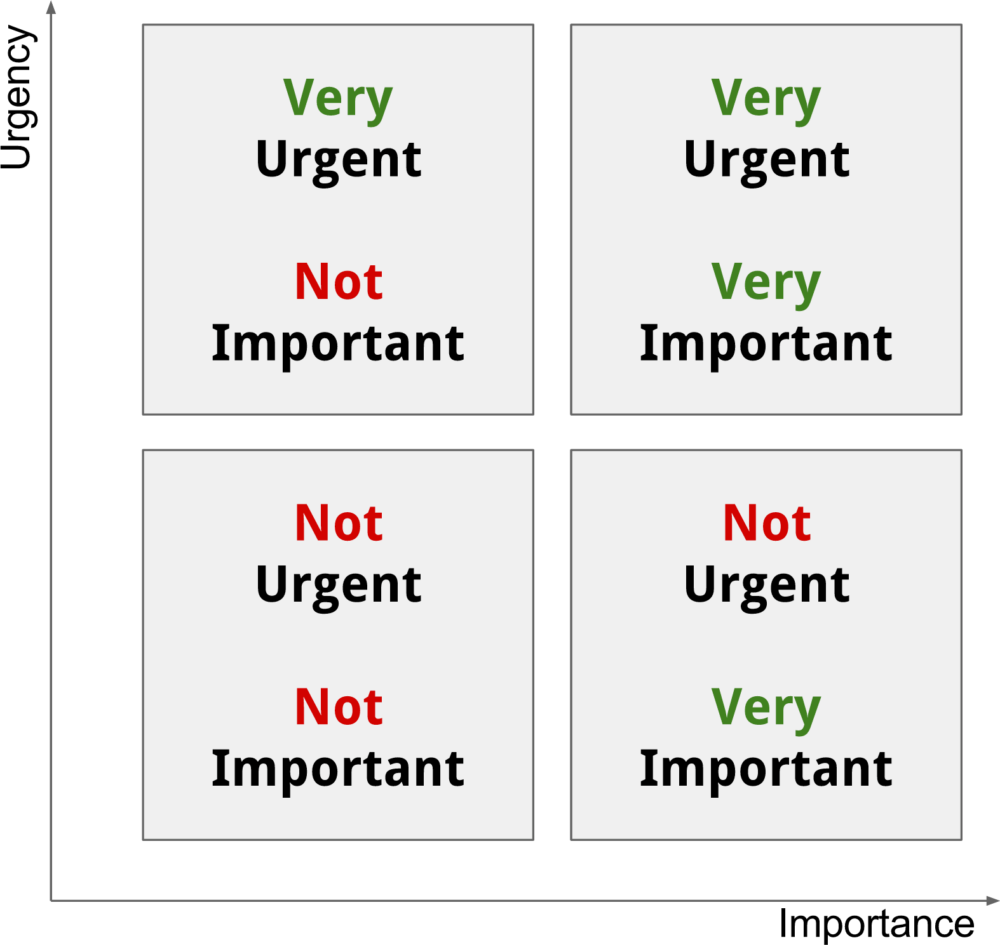
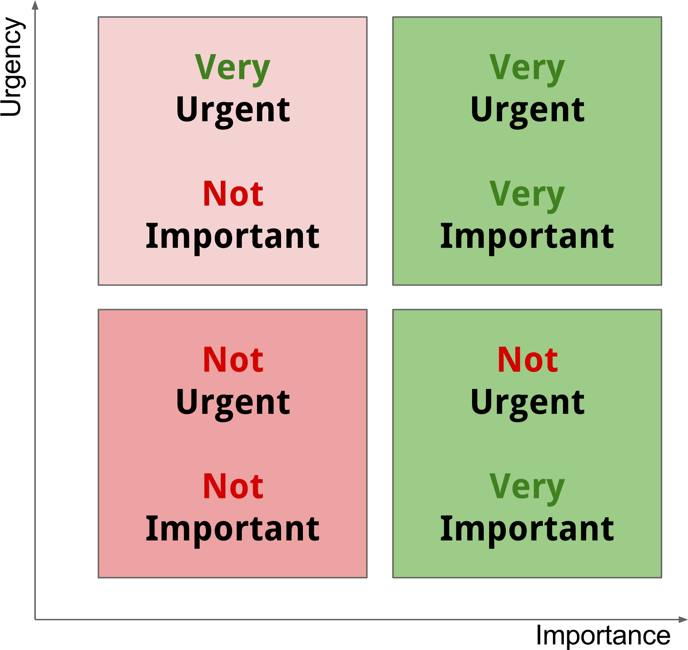
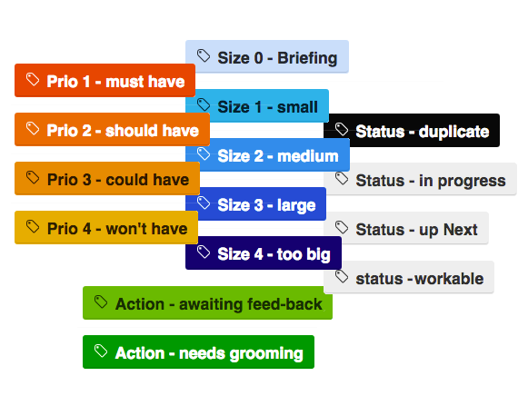

<!--

 To include this markdown in your reveal add the following section:

  <section data-markdown="name-of-your-markdown.md"
    data-separator="^>>>>NEWSECTION$"
    data-separator-vertical="^>>>>NEWSLIDE$"
    data-separator-notes="^Note:$">
  </section>

-->

## _"Software is going to  eat the world"_ [*](http://www.wsj.com/articles/SB10001424053111903480904576512250915629460)<!-- .element target="_blank" -->

...even Librarians need to have some insight into code <!-- .element class="fragment" -->

>>>>NEWSLIDE

## GitHub is a platform
### not just for version controlling code

...but even for collaboration, sharing notes, documentation and planning projects <!-- .element class="fragment" -->

>>>>NEWSLIDE

## Is it safe to say
### that these disciplines are all relevant to librarians too?

Collaboration, sharing notes, slides, knowledge,  documentation and planning projects?

**...if so, then let’s turn whatever you do into code!**<!-- .element class="fragment" -->

>>>>NEWSECTION

### [Manifesto for Agile Software Development*](http://agilemanifesto.org)<!-- .element: target="_blank" -->

<!-- .slide: data-background="res/manifesto.jpg" -->

**Individuals and interactions** over processes and tools

**Working software** over comprehensive documentation

**Customer collaboration** over contract negotiation

**Responding to change** over following a plan

>>>>NEWSLIDE

## Agile planning

Short feed-back loop<!-- .element: class="fragment highlight-current-red" -->

There are no phases in development<!-- .element: class="fragment highlight-current-red" -->

Backlog<!-- .element: class="fragment highlight-current-red" -->

Workable tasks<!-- .element: class="fragment highlight-current-red" -->

Minimize work in progress<!-- .element: class="fragment highlight-current-red" -->

Sprint log<!-- .element: class="fragment highlight-current-red" -->

Definition of Done<!-- .element: class="fragment highlight-current-red" -->

Minimal Viable Product<!-- .element: class="fragment highlight-current-red" -->

>>>>NEWSLIDE

## The Andon Cord

<video  class="stretch" src="../shared/res/andon-cord.mp4"  data-autoplay></video>

>>>>NEWSLIDE

## The software factory floor

<!-- .element: class="plain max" -->

>>>>NEWSLIDE

## Optimizing the factory floor

**Well _any_ process really!**

Unplanned work <!-- .element: class="fragment grow highlight-blue" -->

Queued work <!-- .element: class="fragment grow highlight-blue" -->

>>>>NEWSLIDE

## Unplanned work

<!-- .element: class="plain large" style="position:absolute;left:180px;top:130px;"-->

<!-- .element: class="fragment plain large" style="position:absolute;left:180px;top:130px;"-->

<!-- .element: class="fragment plain large" style="position:absolute;left:180px;top:130px;"-->

<!-- .element: class="fragment plain large" style="position:absolute;left:180px;top:130px;"-->

<!-- .element: class="fragment plain large" style="position:absolute;left:180px;top:130px;"-->

<!-- .element: class="fragment plain large" style="position:absolute;left:180px;top:130px;"-->

<!-- .element: class="fragment plain large" -->

>>>>NEWSLIDE

## Kanban

To Do <!-- .element: class="fragment left grow" style="width:33%;" -->

Doing <!-- .element: class="fragment left grow" style="width:33%;" -->

Done <!-- .element: class="fragment left grow" style="width:33%;" -->

>>>>NEWSLIDE

[<!-- .element: class="plain" -->](http://www.praqma.com/stories/milestones-and-officehours/)<!-- .element: target="_blank" -->

>>>>NEWSECTION

## Create a new repo to play with!

1. On GitHub, fork [`praqma/librarian`](https://github.com/Praqma/librarian)<!-- .element: target="_blank" --> to your own user
2. In your own fork, go to `settings` and enable GitHub Pages, pointing to the `master` branch
3. Browse to http://your-user-name.github.io/librarian-as-coder
4. Now go and tinker with the  `/librarian-as-coder/librarian-as-coder.md` file in your repository
5. Each commit updates the live website!

>>>>NEWSECTION

## Some Reveal tricks

[Documentation](https://github.com/hakimel/reveal.js)<!-- .element: target="_blank" -->

[Sample](http://lab.hakim.se/reveal-js/)<!-- .element: target="_blank" -->

>>>>NEWSLIDE

## [Fragments*](http://lab.hakim.se/reveal-js/#/fragments)<!-- .element: target="_blank" -->

grow

shrink

fade-out

fade-up<!-- .element: class=" left" style="width:25%;"-->

fade-down<!-- .element: class=" left" style="width:25%;" -->

fade-left<!-- .element: class=" left" style="width:25%;" -->

fade-right<!-- .element: class=" left" style="width:25%;" -->

current-visible

highlight-current-blue, -red & green

highlight-red, -blue & -green

>>>>NEWSLIDE

## [Fragments*](http://lab.hakim.se/reveal-js/#/fragments)<!-- .element: target="_blank" -->

grow <!-- .element: class="fragment grow" -->

shrink <!-- .element: class="fragment shrink" -->

fade-out <!-- .element: class="fragment fade-out" -->

fade-up<!-- .element: class="fragment fade-up left" style="width:25%;"-->

fade-down<!-- .element: class="fragment fade-down left" style="width:25%;" -->

fade-left<!-- .element: class="fragment fade-left left" style="width:25%;" -->

fade-right<!-- .element: class="fragment fade-right left" style="width:25%;" -->

current-visible <!-- .element: class="fragment current-visible" -->

highlight-current-blue<!-- .element: class="fragment highlight-current-blue" -->, -red<!-- .element: class="fragment highlight-current-red" --> & green<!-- .element: class="fragment highlight-current-green" -->

highlight-red<!-- .element: class="fragment highlight-red" -->, -blue<!-- .element: class="fragment highlight-blue" --> & -green<!-- .element: class="fragment highlight-green" -->

>>>>NEWSLIDE
## [Slide transitions*](http://lab.hakim.se/reveal-js/#/transitions)<!-- .element: target="_blank" -->

None

Fade

Slide

Convex

Concave

Zoom

>>>>NEWSLIDE

## [Themes*](http://lab.hakim.se/reveal-js/?transition=none#/themes)<!-- .element: target="_blank" -->

Black (default) 
White 
League 
Sky 
Beige 
Simple 
Serif 
Blood 
Night 
Moon 
Solarized

>>>>NEWSECTION
## Wrap up
